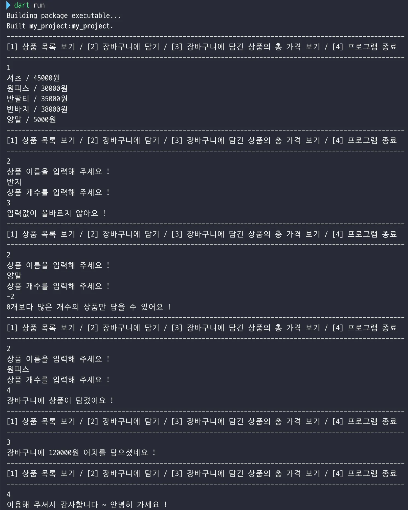
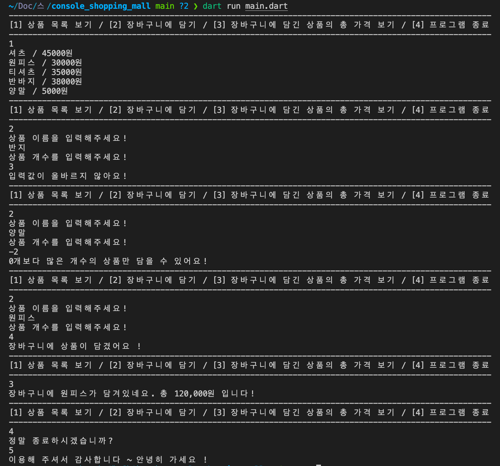

# 팀 스파르타 앱 창업 5기 2주차 개인 과제 - 콘솔 쇼핑몰 만들기

## 시나리오
- 판매하는 상품 목록을 볼 수 있는 기능
- 구매자가 구매하고 싶은 상품들을 장바구니에 담을 수 있는 기능
- 구매자가 장바구니에 담은 상품들의 총 가격을 볼 수 있는 기능

## 구현 예시



## 요구 사항

### 필수 기능

### 1. 판매하는 상품 목록을 볼 수 있는 기능

**[ 설명 ]**

- `1` 을 입력했을 때 판매하고 있는 상품 목록을 출력합니다.

**[ 조건 ]**

- 출력 형태 : `[상품명] / [상품 1개당 가격]원`
    
    ```dart
    셔츠 / 45000원
    원피스 / 30000원
    반팔티 / 35000원
    반바지 / 38000원
    양말 / 5000원
    ```
    

**[ 힌트 ]**

- 반복문을 통해 상품의 정보를 하나씩 출력합니다.

---

### 2. 상품을 장바구니에 담을 수 있는 기능

**[ 설명 ]**

- `2` 를 입력했을 때 장바구니에 담을 상품 이름 (`String`) 과 상품 개수 (`int`) 를 입력 받습니다.

**[ 조건 ]**

- 입력한 상품의 이름이 상품 목록에 있지 않거나 상품의 개수가 0 이하의 값이면 장바구니에 담기지 않습니다.
    - 상품 목록에 없는 상품의 이름을 입력한 경우 `입력값이 올바르지 않아요 !` 를 출력합니다.
    - 상품의 개수를 숫자 형태로 입력하지 않은 경우 `입력값이 올바르지 않아요 !` 를 출력합니다.
    - 입력한 상품의 개수가 0 이하의 수인 경우 `0개보다 많은 개수의 상품만 담을 수 있어요 !` 를 출력합니다.
- 입력한 상품의 이름과 상품의 개수가 올바른 값이면 장바구니에 담깁니다.
    - 이 경우 `장바구니에 상품이 담겼어요 !` 를 출력합니다.

**[ 힌트 ]**

- 조건문과 `try-catch` 문을 통해 입력값에 대한 처리를 할 수 있습니다.
- `contains()` 또는 고차 함수를 통해 입력한 상품의 이름이 상품 목록에 있는지 판별할 수 있습니다.
- `int.parse()` 를 통해 입력한 상품의 개수를 `int` 타입으로 변환할 수 있습니다.
- 장바구니에 담은 상품들의 총 가격을 담기 위한 인스턴스 변수를 `ShoppingMall` 클래스에 정의한 후 그 인스턴스 변수의 값에 더해줍니다.

---

### 3. 장바구니에 담은 상품들의 총 가격을 볼 수 있는 기능

**[ 설명 ]**

- `3` 을 입력했을 때 구매자가 장바구니에 담은 상품들의 총 가격 (`int`) 을 계산하여 출력합니다.

**[ 조건 ]**

- 출력 형태 : `장바구니에 [가격]원 어치를 담으셨네요 !`
    
    ```dart
    장바구니에 35000원 어치를 담으셨네요 ! 
    ```
    

---

### 4. 쇼핑몰 프로그램을 종료할 수 있는 기능

**[ 설명 ]**

- `4` 를 입력했을 때 쇼핑몰 프로그램이 종료됩니다.

**[ 조건 ]**

- `이용해 주셔서 감사합니다 ~ 안녕히 가세요 !` 출력 후 프로그램을 종료합니다.

**[ 힌트 ]**

- `while` 문을 사용하고, 프로그램을 종료하기 위한 `bool` 타입의 변수로 `while` 문을 제어합니다.

### 도전 기능

### 1. 쇼핑몰 프로그램을 종료할 시 한번 더 종료할 것인지 물어보는 기능

**[ 설명 ]**

- `4`를 입력하면 `정말 종료하시겠습니까?` 출력 이후 `5`를 입력하면 `이용해 주셔서 감사합니다 ~ 안녕히 가세요!` 출력 후 종료합니다.

**[ 조건 ]** 

- `4`를 입력 후 `5`를 입력하지 않고 다른 값 입력 시 `종료하지 않습니다.` 출력

**[ 힌트 ]**

- **`4`를 입력했을 때** `dart:io` 라이브러리의 `stdin.readLineSync()`를 한번 더 호출하여 입력을 받고 **조건문 이용하여 처리할 수 있습니다.**

---

### 2. 장바구니를 초기화할 수 있는 기능

**[ 설명 ]**

- `6`을 입력하면 `장바구니를 초기화합니다.` 출력 후 장바구니를 초기화합니다.

**[ 조건 ]**

- 장바구니가 비어있는 상태에서 `6`을 입력 시 `이미 장바구니가 비어있습니다.` 출력

**[ 힌트 ]**

- **`6`을 입력 했을 때 `total` 변수의 값에 따라 조건문을 두어 처리할 수 있습니다.**

---

### 3. 장바구니에 담은 상품들의 목록과 가격을 볼 수 있는 기능

**[ 설명 ]**

- `3`을 입력 시 장바구니에 담긴 상품 목록과 장바구니에 담긴 상품들의 금액 총합을 출력합니다.

**[ 조건 ]**

- 장바구니가 비어있을 경우 `장바구니에 담긴 상품이 없습니다.` 출력
- 출력 형태 : `장바구니에 셔츠, 청바지, 넥타이가 담겨있네요. 총 [가격]원 입니다!`

**[ 힌트 ]**

- **장바구니에 담길 상품 이름을 담을 변수를 `List` 타입의 변수로 새로 생성하고, 리스트 내 요소를 한번에 출력할 수 있는 `join` 함수를 이용해 보세요 .**

---

### 4. 자유롭게 여러분만의 기능을 추가해보세요!

**[ 설명 ]**

- 단, **`필수 기능을 반드시 먼저 완성`**한 뒤에 꿈을 펼쳐봅시다.

## 구현 결과

